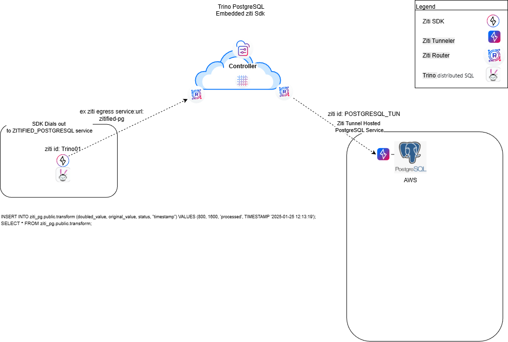
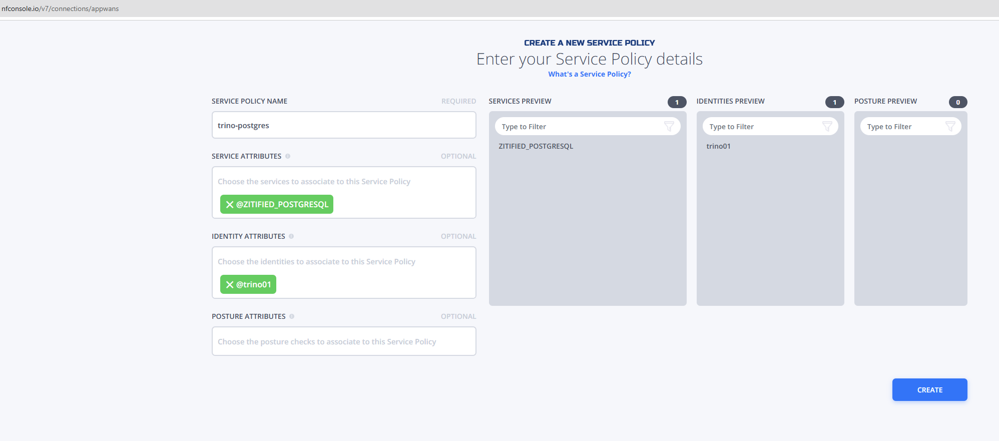
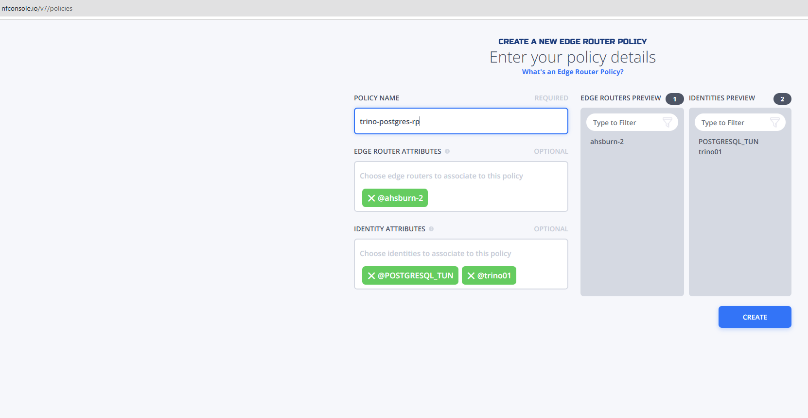

# Zitified-Trino-Prostgres

zitified-trino-postgres provides an example of creating a ziti socketFactory that the standard
 Postgres JDBC Driver's built-in support for custom socketFactory classes can utilize.

# How it works:

Trino loads the stock Postgres connector. The Catalog configuration (ziti_pg.properties) specifies our custom 
ZitiPostgresSocketFactory. The Plugin (ZitiPostgresPlugin) ensures the OpenZiti SDK and our interceptor class 
are available in the JVM's classpath. The Driver hands off socket creation to our code, which authenticates
via the OpenZiti Identity and tunnels the traffic over the secure Ziti fabric.

## Build the Example
On the linux system that will run the host the trino docker container:

Pre-reqs:
- Install maven if not already installed.

- Install docker and docker compose if not already installed.

- Install java jdk 21.
```
mkdir repos
cd repos
git clone https://github.com/netfoundry/zitified-trino-postgres.git
cd zitified-trino-postgres
mvn clean package -nsu
cp target/trino-postgres-ziti-1.0.0.jar trino-ziti-test/plugin/ziti-postgres
```

## Setup and Configure the Example



Create or use an existing ziti network with at least one edge router. This can be accomplished using the Netfoundry
Console.


1. Create and enroll two ziti identities
   ```
   a. trino01
      Enroll the identity and name the identity file identity.json and place in the 
      repos/zitified-trino-postgres/trino-ziti-test folder on the linux system in "Build the Example" section 
      above.
   b. POSTGRESQL_TUN
   ```
The following assumes naming in the network diagram but can be substituted per preference:

2. Create an advanced service named ZITIFIED_POSTGRESQL.  Set the protocol to "tcp", set the intercept ip to "zitified-pg",
   set the port to 5432, select identity @POSTGRESQL_TUN, set forward address to no and address to 127.0.0.1 and set forward port 
   to yes.

   
3. Create a Service Policy to enable trino01 to access the ZITIFIED_POSTGRESQL service
   

4. 6. Create a router policy and with the NF hosted edge-router and the trino01/POSTGRESQL_TUN as the identities e.g.



4. Install and setup postgreSQL server on vm and install and run zeti-edge-tunnel with POSTGRESQL_TUN Identity [Linux](https://netfoundry.io/docs/openziti/reference/tunnelers/linux/)
5. Create db: mydb, user: myuser, password: mypassword, grant all permissions on mydb to myuser
6. create table transform e.g.
   ```
   CREATE TABLE transform (
       id SERIAL PRIMARY KEY,          -- auto‑incrementing unique identifier
       doubled_value   INTEGER NOT NULL,
       original_value  INTEGER NOT NULL,
       status          VARCHAR(50) NOT NULL,
       timestamp       TIMESTAMP NOT NULL
       );
   ```
8. On the trino01 host perform the following from the repos/zitified-trino-postgres/trino-ziti-test folder
   ```
   sudo docker compose down && sudo docker compose up -d && sudo docker logs trino-ziti -f
   ```
   You should see this line at when it finishes loading
   ```
   2026-01-28T21:19:15.356Z	INFO	main	io.trino.server.Server	======== SERVER STARTED ========
   ```
9. From another terminal window on the trino01 host
   ```
   sudo docker exec -it trino-ziti trino
   trino> INSERT INTO ziti_pg.public.transform (doubled_value, original_value, status, "timestamp") VALUES (800, 1600, 'processed', TIMESTAMP '2025-01-25 12:13:19');

   #output
   INSERT: 1 row

   trino> SELECT * FROM ziti_pg.public.transform;

   #output
   id | doubled_value | original_value |  status   |         timestamp          
   ----+---------------+----------------+-----------+----------------------------
   1 |           800 |           1600 | processed | 2025-01-25 12:13:19.000000 
   (1 row)
   ```

   9. In the terminal open in step 7 should see output similar to 
   ```
   2026-01-28T21:35:56.348Z	INFO	main	io.trino.server.Server	======== SERVER STARTED ========
   2026-01-28T21:36:17.931Z	INFO	Query-20260128_213617_00000_fgrbv-153	stderr	>>>> [ZITI] Loading Identity: /etc/trino/ziti/identity.json
   2026-01-28T21:36:18.395Z	INFO	Query-20260128_213617_00000_fgrbv-153	stderr	[Query-20260128_213617_00000_fgrbv-153] INFO org.openziti.impl.ZitiImpl - ZitiSDK version 0.31.1 @6a10eae()
   2026-01-28T21:36:19.695Z	INFO	DefaultDispatcher-worker-2	stderr	[DefaultDispatcher-worker-2] INFO org.openziti.net.dns.ZitiDNSManager - assigned zitified-pg => zitified-pg/100.64.1.2 []
   2026-01-28T21:36:19.696Z	INFO	DefaultDispatcher-worker-2	stderr	[DefaultDispatcher-worker-2] INFO org.openziti.net.dns.ZitiDNSManager - registered: zitified-pg => zitified-pg/100.64.1.2
   2026-01-28T21:36:20.939Z	INFO	Query-20260128_213617_00000_fgrbv-153	stderr	>>>> [ZITI DEBUG] Resolved zitified-pg to 100.64.1.2
   2026-01-28T21:36:20.939Z	INFO	Query-20260128_213617_00000_fgrbv-153	stderr	>>>> [ZITI DEBUG] Dialing: 100.64.1.2:5432
   2026-01-28T21:36:25.424Z	INFO	SplitRunner-20260128_213617_00000_fgrbv.0.0.0-9-222	stderr	>>>> [ZITI DEBUG] Resolved zitified-pg to 100.64.1.2
   2026-01-28T21:36:25.425Z	INFO	SplitRunner-20260128_213617_00000_fgrbv.0.0.0-9-222	stderr	>>>> [ZITI DEBUG] Dialing: 100.64.1.2:5432
   2026-01-28T21:36:26.105Z	INFO	dispatcher-query-4	io.trino.event.QueryMonitor	TIMELINE: Query 20260128_213617_00000_fgrbv :: FINISHED :: elapsed 8250ms :: planning 413ms :: waiting 6801ms :: scheduling 7016ms :: running 31ms :: finishing 790ms :: begin 2026-01-28T21:36:17.85Z :: end 2026-01-28T21:36:26.1Z
   2026-01-28T21:36:37.290Z	INFO	Query-20260128_213637_00001_fgrbv-152	stderr	>>>> [ZITI DEBUG] Resolved zitified-pg to 100.64.1.2
   2026-01-28T21:36:37.290Z	INFO	Query-20260128_213637_00001_fgrbv-152	stderr	>>>> [ZITI DEBUG] Dialing: 100.64.1.2:5432
   2026-01-28T21:36:38.001Z	INFO	dispatcher-query-5	io.trino.event.QueryMonitor	TIMELINE: Query 20260128_213637_00001_fgrbv :: FINISHED :: elapsed 712ms :: planning 19ms :: waiting 482ms :: scheduling 520ms :: running 67ms :: finishing 106ms :: begin 2026-01-28T21:36:37.288Z :: end 2026-01-28T21:36:38Z
   ```

   


